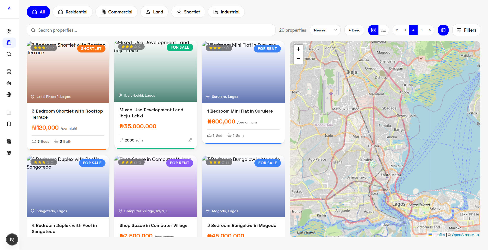

The dashboard needs to be and have a  comprehensive overview too. We should have more important things in the sidebar too (like logout and theme switching). Mabe a light/dark mode switch(look at first screenshot), profile and any oher relevant thing.

We will also be using animated lists for when scrolling through list views (npm install motion)

We also need per page items and pagination.
For the settings page (take a look at second screenshot and third screenshots for web and mobile), Also in the second screenshot, notice how there's a top bar (with notifications, theme switch and profile). I want that.

The favicon logo should be much bigger on the collapsed sidebar (check screenshot).. It is small right now

Make sure the grid of 2, 3, 4, 5,6 is working, only 2 and 3 are working right now. Make sure i can multiselect property filters too.

We will also be using the @components/skeleton.tsx  component for all our pages
I want the 'compact number' component and animated counter.

Use the components I added to the root folder @components/ ... Move that to @frontend/ by the way and make sure they are compatible They'll help you do very things we will be needing as we build. 

It should also understand the difference between '1 properties' (which is wrong) and '1 property' which is right. I noticed this when i applied filters. correct app wide.

Also I'm planning to use koyeb for my backgrond jobs instead of render (if it's not needed though, let me know but koyeb is cheaper, that's all), i'll need step to step instructions as to how to set it up and what you'll need, maybe put that in a file in the root folder and update @CHECKLIST.md and codebase as necessary to accommodate it 

 i also want a kind of service that can automatically be ranking my sites and the quality of data they provide with recommendations  

The mobile bottom nav menus should be dashboard, properties, scrape, search and more (more toggles the sidebar)... But when you're on the properties page , the 'filter' button should appear.

